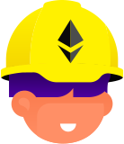

# Sr. Full Stack Web/Web3 Developer with the latest technologies

🔭 A frontend heavy full stack web/web3 developer with 8+ years experience in web development, using the latest technologies, languages, frameworks, and libraries in different areas, including frontend, backend, full stack, and web3.

- JavaScript, TypeScript, C#, PHP, Python, Ruby
- React(Redux, Mobx, Context), Next.js, Blitz.js, Gatsby
- Ionic Framework, React Native, Expo
- Tailwind CSS, SCSS/LESS, Styled components
- ASP.NET, Django(DRF), Flask, Ruby on Rails
- Unit Testing, E2E Testing, Integration Testing, Jest, Cypress, React Testing Library
- GraphQL, REST API
- Node.js, Express.js, Koa.js, Nest.js
- Hardhat, Truffle
- Docker, Kubernetes, AWS, GCP
- MySQL, PostgreSQL, SQLite, SQL Server
- MongoDB, DynamoDB
- Elastic Search, Nginx, Redis, Memcache
<table align="center">

  <tr>
    <td align="center" width="90">
      
       React
    </td>
    <td align="center" width="90">
      
       Next.js
    </td>
    <td align="center" width="90">
      
       Vue
    </td>
    <td align="center" width="90">
      
       Nuxt.js
    </td>
    <td align="center" width="90">
      
       Angular
    </td>
    <td align="center" width="90">
      
       Svelte
    </td>
    <td align="center" width="90">
      
       Tailwind
    </td>
    <td align="center" width="90">
        
       GraphQL
    </td>
    <td align="center" width="90">
      
       Three.js
    </td>
    <td align="center" width="90">
      
       Android
    </td>
  </tr>
  <tr>
    <td align="center" width="90">
      
       Ruby
    </td>
    <td align="center" width="90">
      
       GoLang
    </td>
    <td align="center" width="90">
      
       Express
    </td>
    <td align="center" width="90">
      
       Nest.js
    </td>
    <td align="center" width="90">
      
       Django
    </td>
    <td align="center" width="90">
      
       Laravel
    </td>
    <td align="center" width="90">
      
       Flutter
    </td>
    <td align="center" width="90">
      
       MongoDB
    </td>
    <td align="center" width="90">
      
       PostgreSQL
    </td>
    <td align="center" width="90">
      
       Python
    </td>
  </tr>
  <tr>
    <td align="center" width="90">
      
       NFT
    </td>
    <td align="center" width="90">
      
       DeFi
    </td>
    <td align="center" width="90">
      
       Ethereum
    </td>
    <td align="center" width="90">
      
       Solana
    </td>
    <td align="center" width="90">
      
       Solidity
    </td>
    <td align="center" width="90">
      
       Rust
    </td>
    <td align="center" width="90">
      
       Anchor
    </td>
    <td align="center" width="90">
      
       Foundry
    </td>
    <td align="center" width="90">
      
       HardHat
    </td>
    <td align="center" width="90">
      
       Rails
    </td>
  </tr>
</table>
👯 I am looking to collaborate on web applications, decentralized applications, mainly open source projects.

## My GitHub Stats 📊

	

